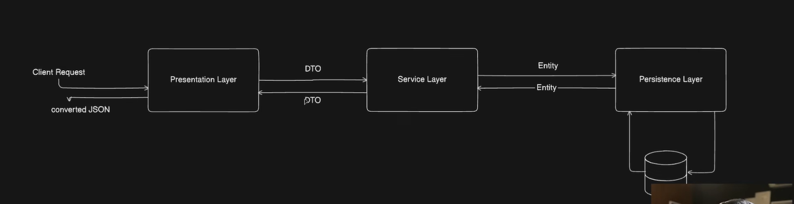

# 🎓 Student Management REST API Mini Project

A simple CRUD-based REST API built using Spring Boot for managing student records.

---

## ✨ Features

- Create a new student
- Get all students
- Get student by ID
- Update student details
- Partial update using PATCH
- Delete student
- Input validation using Jakarta Validation
- DTO ↔ Entity mapping using ModelMapper
- Exception Handling (To be Done)

---

## 🛠️ Tech Stack

- Java
- Spring Boot
- Spring Web
- Spring Data JPA
- PostgreSQL
- Hibernate
- Lombok
- ModelMapper
- Maven

---

## 📁 Project Structure

```text
src/main/java/com/restapi/RestAPILesson
│
├── controller
├── service
│   └── impl
├── repository
├── entity
├── dto
└── config
```

---

## 🌐 API Endpoints

| Method | Endpoint | Description |
|--------|----------|-------------|
| GET | `/students` | Get all students |
| GET | `/students/{id}` | Get student by ID |
| POST | `/students` | Add new student |
| PUT | `/students/{id}` | Update student completely |
| PATCH | `/students/{id}` | Update student partially |
| DELETE | `/students/{id}` | Delete student |

---

## 📦 Sample Request Body

### Create Student

```json
{
  "name": "Tanish",
  "city": "Mumbai",
  "email": "tanish@gmail.com",
  "marks": 91
}
```

---

## ✅ Validation Features

- Name length validation
- Email format validation
- Marks range validation (0–100)

---

## 🚀 How To Run

1. Clone the repository

```bash
git clone https://github.com/Tanish2207/spring-boot-rest
```

2. Open project in IntelliJ IDEA

3. Configure PostgreSQL database in:

```properties
application.properties
```

4. Run the application

5. Test APIs using Postman

---

## 📚 Learning Objectives

This project helped me learn:

- REST API development
- Layered architecture
- DTO and Entity separation
- CRUD operations
- Validation
- Exception handling (to be done)
- Spring Boot fundamentals
- JPA & Hibernate basics

---

# 🤔 Some Doubt Questions and Answers

---

## 1️⃣ Architecture



Currently, the project has **Layered Architecture**.

Presentation → Service → Persistence is also a Layered Architecture.

### Mapping

| Actual | Video |
|---|---|
| Presentation Layer | controller + dto |
| Service Layer | service |
| Persistence Layer | repo + entity |
| DB | Postgres |

### MVC is a WEB DESIGN PATTERN

| MVC Component | Responsibility |
|---|---|
| M | Data/business |
| V | UI |
| C | Request handling |

Modern Spring Boot REST APIs use:

```text
MVC + Layered Architecture
```

---

## 2️⃣ Error Handling

Standard industry approach:
Use `@RestControllerAdvice` in a separate `GlobalExceptionHandler` class.

This gives custom error messages directly in HTTP responses.

---

## 3️⃣ Use `@Nullable` in PATCH instead of `Map<String, Object>`

Industry standard:
Use different DTOs for different operations.

```java
public class UpdateStudentDTO {

    private String name;

    private String city;

    private String email;

    private Long marks;
}
```

```java
@PatchMapping("/students/{id}")
public ResponseEntity<StudentDTO> updateStudent(
        @PathVariable UUID id,
        @RequestBody UpdateStudentDTO dto) {

    return ResponseEntity.ok(
        studentService.partialUpdate(id, dto)
    );
}
```

- No need for `@Nullable` because object reference fields in Java are already nullable.
- More type-safe than `Map<String, Object>`.

---

## 4️⃣ Exact Use of Interfaces

Interface = CONTRACT  
Defines:
> WHAT operations are available

### Advantages

- Multiple implementations can be made
    - `StudentServiceMongoImpl`
    - `StudentServiceSQLImpl`

- Different services can use different implementations
    - Student Service → SQLImpl
    - Analytics Service → MongoImpl

- Can use `@Qualifier` for choosing implementation

```java
@Service("sqlService")
public class StudentServiceSqlImpl implements StudentService
```

```java
@Service("mongoService")
public class StudentServiceMongoImpl implements StudentService
```

```java
@RequiredArgsConstructor
@RestController
public class StudentController {

    @Qualifier("sqlService")
    private final StudentService studentService;
}
```